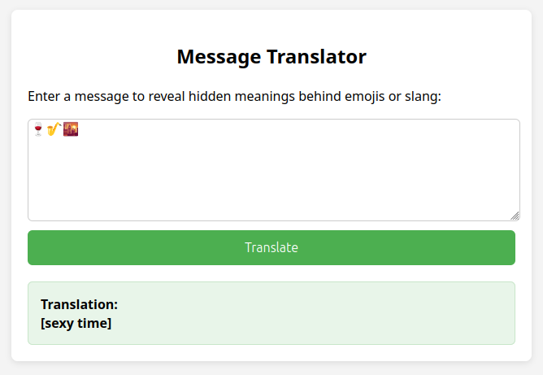

# Emoji & Slang Message Translator

**Created by [David Sopas](https://github.com/dsopas)**  
🔗 Live Demo: [https://msgdecode.com](https://msgdecode.com)

A simple web app that helps parents, educators, or anyone decode hidden meanings in messages containing emojis and slang. Built to raise awareness about potentially inappropriate or risky content often found in teen messaging, this tool translates emojis, emoji combos, and text slang into plain English.

---

## 🚀 Features

- ✅ Translates individual emojis and emoji **combinations** (e.g. `👉👌`)
- ✅ Detects and decodes **modern slang** and **chat acronyms** (e.g. *DTF*, *Netflix and chill*)
- ✅ Works entirely **client-side** — no data is saved or sent
- ✅ **Mobile-friendly** responsive design
- ✅ Lightweight, fast, and easy to use

---

## 💻 How to Use

1. Paste or type a message into the text box (e.g. from a chat or SMS).
2. Click the **Translate** button.
3. The app will display the interpreted meaning of emojis and slang.

---

## 📸 Screenshots

Here’s a quick look at the Emoji & Slang Message Translator in action:



---

## 🛠️ Installation (for local use or customization)

```bash
git clone https://github.com/dsopas/emoji-translator.git
cd emoji-translator
# Then just open index.html in your browser 
```

Or just double-click index.html if you downloaded the ZIP.

---

## 📄 License

This project is licensed under the [MIT License](LICENSE).
Please see [DISCLAIMER.txt](DISCLAIMER.txt) for intended use and legal notice.

---

## 🙌 Acknowledgments

Inspired by resources from GetKidas and other digital safety initiatives.
Thanks to the community for continued contributions and improvements.

---

## 👋 Want to Contribute?

Pull requests are welcome! Feel free to open issues to suggest features, emoji/slang additions, or bug fixes.
